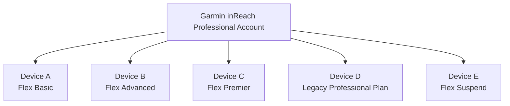
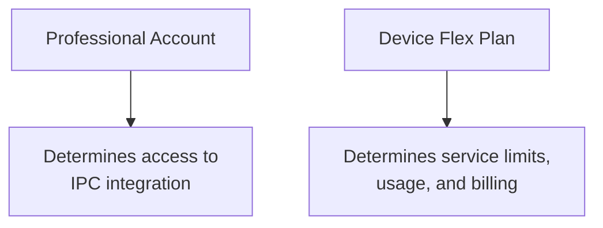
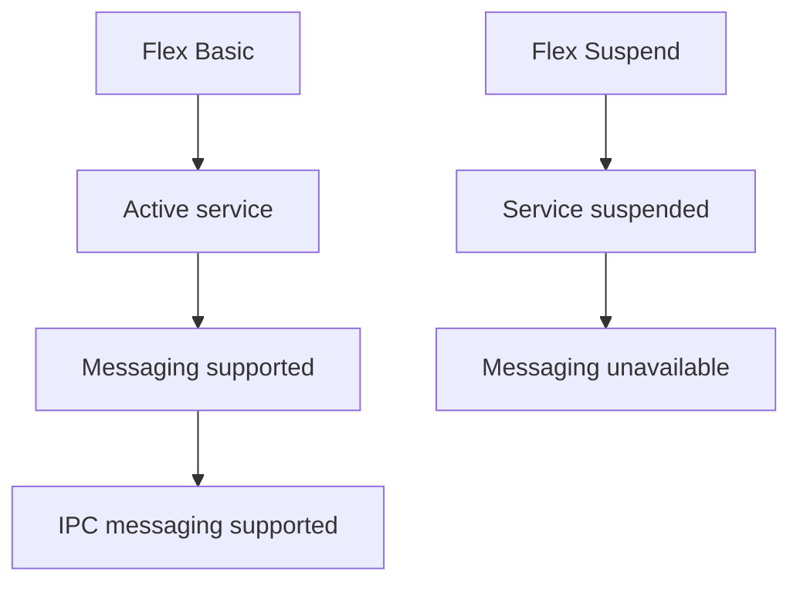
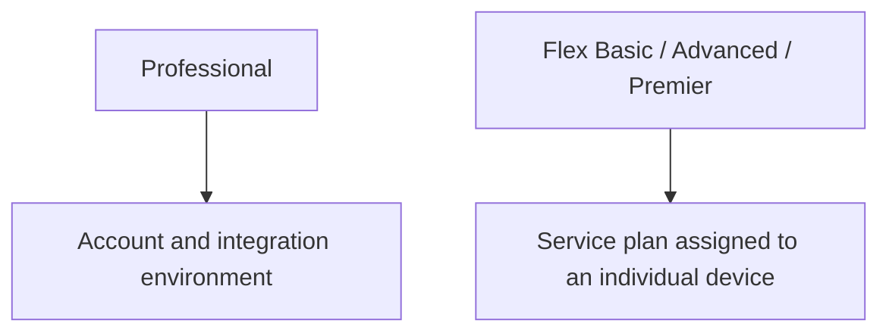

# Garmin Accounts & Flex Plans

!!! warning "Disclaimer"
    The information on this page is based on our reading of Garmin's public documentation and has **not been verified by Garmin**. Account types, service plans, capabilities, and pricing are subject to change — confirm details with Garmin before relying on them for purchasing or billing decisions.

This page explains how Garmin inReach Professional accounts and Professional Flex service plans relate to this integration, which uses Garmin **inReach Portal Connect (IPC)**.

It is intended to answer these questions:

- What does Garmin mean by a **Professional** account?
- What are **Flex Basic**, **Flex Advanced**, and **Flex Premier**?
- Can devices with different service plans coexist in the same Professional account?
- Can a Flex Basic device send data to EarthRanger through IPC Outbound?
- Can EarthRanger send messages to a Flex Basic device through IPC Inbound?

## Summary

**Flex Basic is not an alternative to a Garmin Professional account.**

A useful way to think about Garmin's terminology is:

- **Professional** describes the account and device-management environment.
- **Flex Basic, Flex Advanced, and Flex Premier** are service plans assigned to individual devices within that account.
- A single Professional account can contain devices on different Flex plans and, in some cases, older legacy Professional plans.
- Garmin's IPC integration is associated with the Professional account.
- An active Flex Basic device can participate in IPC Outbound and can receive text messages sent through IPC Inbound.
- The Flex plan affects usage allowances, tracking intervals, and billing rather than defining a different integration mechanism.

## Professional accounts vs. device service plans

The most important distinction is between the **Garmin account type** and the **service plan assigned to an individual inReach device**.

Conceptually:

Garmin describes Professional accounts as providing centralized administration and billing for multiple devices.

Each device has an associated service plan. Garmin's Professional account documentation also indicates that invoices identify the devices on an account and their associated service plans.

Garmin administrators can change the service plan assigned to individual devices through the **Plans & Devices** section of Garmin Explore.

Garmin also allows some devices to remain on older Professional plans rather than automatically migrating them to newer Flex plans. As a result, it is possible for a single Professional account to contain a mixture of newer Flex plans and legacy Professional plans.

### Garmin terminology

Current Garmin Professional device plans include names such as:

- Flex Basic
- Flex Advanced
- Flex Premier
- Flex Enabled
- Professional Flex Suspend

Older Professional service plans may also still exist for existing customers.

This explains statements such as:

> "Some of our devices are Professional and some are Flex Basic."

A more precise description would usually be:

> "We have a Garmin Professional account containing devices on different service plans, including Flex Basic."

## Garmin inReach Portal Connect

Garmin provides integration capabilities through **inReach Portal Connect (IPC)**. This connector uses both directions of communication.

### IPC Outbound

IPC Outbound sends information received from inReach devices to this connector, which forwards it through Gundi to EarthRanger.

The general flow is:

Garmin describes IPC Outbound as a data-push service for Professional and Enterprise inReach customers.

Messages and other supported data received by Garmin from registered devices can be forwarded to a configured HTTP endpoint.

For this integration, the Professional account administrator configures the connector's webhook URL (provided by Gundi) in Garmin — see [Configuration](configuration.md).

See:

- [Garmin IPC Outbound Developer Guide](https://developer.garmin.com/inReach/IPC_Outbound.pdf)

### IPC Inbound

IPC Inbound allows EarthRanger (via Gundi and this connector) to communicate with devices belonging to the Garmin Professional account.

The general flow is:

Garmin documents IPC Inbound capabilities including:

- sending text messages;
- requesting a device's location;
- enabling or disabling tracking; and
- changing the tracking interval.

This connector currently uses the **Message Command** — sending text messages composed in EarthRanger to devices.

IPC Inbound validates that the target device belongs to the appropriate Garmin Professional tenant.

See:

- [Garmin IPC Inbound Developer Guide](https://developer.garmin.com/inReach/IPC_Inbound.pdf)

## Does Flex Basic support IPC integration?

**Yes.**

Garmin describes inbound and outbound API integration as a capability of its **Professional** offering.

Garmin does not document IPC as requiring a device to be on Flex Advanced or Flex Premier.

Therefore, an active device on **Flex Basic** that belongs to an IPC-enabled Professional account should participate in the same IPC integration as other active devices in that account.

For integration purposes, this distinction is useful:

Flex Basic should therefore not be modeled as a separate Garmin integration type — Flex Basic devices use the same Gundi integration as every other active device in the account.

## Can a Flex Basic device send data through IPC Outbound?

**Yes.**

A Flex Basic device belongs to the same Professional account as other devices and can send supported inReach data through Garmin.

That data can then be forwarded through the Professional account's IPC Outbound configuration:

The Flex Basic service plan may affect things such as:

- included messages;
- tracking interval;
- tracking-point charges; and
- other usage-related limits.

Those limits do not imply a different IPC integration mechanism.

## Can a Flex Basic device receive messages through IPC Inbound?

**Yes.**

Garmin's IPC Inbound API includes a **Message Command** that sends a text message to an inReach device over the Iridium satellite network — this is what the connector's `push_messages` action uses.

Flex Basic also explicitly supports two-way text messaging.

There is no documented requirement for the target device to use Flex Advanced or Flex Premier.

The expected flow is:

An active Flex Basic device should therefore be able to receive messages sent from EarthRanger through IPC Inbound.

## Message usage and billing

Messages sent through IPC use Garmin's satellite service and may affect the device's service-plan usage.

Garmin's IPC documentation indicates that commands transmitted through Iridium are subject to the device owner's service plan.

Flex Basic currently includes a monthly text-message allowance, with additional messages billed as overages.

We therefore expect an IPC Inbound text message (i.e., a message sent from EarthRanger) to count as messaging usage under the device's Garmin subscription.

However, Garmin's IPC documentation contains terminology inherited from older byte-based Professional plans and does not clearly document exactly how an IPC-originated message is represented in the current Flex Basic usage counter.

For applications where billing details are important, we recommend either:

1. confirming the behavior directly with Garmin; or
2. sending a test message from EarthRanger and reviewing the resulting device usage.

## Suspended devices

A device on **Professional Flex Suspend** should not be treated as an active IPC messaging device.

Garmin states that normal inReach functionality is unavailable while a device is suspended, including:

- messaging;
- tracking; and
- inReach weather requests.

The device must return to an active service plan before these services resume.

This is an important distinction:

Garmin also offers **Flex Enabled**, which is different from Flex Suspend and retains selected functionality on a usage-based basis.

## Flex Basic service limits

At the time this document was last reviewed, Garmin listed the following characteristics for Flex Basic:

| Capability               | Flex Basic           |
| ------------------------ | -------------------- |
| Included text messages   | 50 per month         |
| Additional text messages | $0.50 each           |
| Tracking interval        | 10 minutes or longer |
| Live track points        | $0.10 each           |
| Emergency SOS messaging  | Unlimited            |

These values are Garmin subscription terms and may change.

Refer to Garmin's current Professional subscription documentation before relying on these values for pricing or billing decisions.

## What matters when configuring an integration

For IPC integration, the most important question is usually **not**:

> Is this device on Flex Basic or Flex Advanced?

Instead, verify the following.

### 1. Professional account

Confirm that the device belongs to the organization's **Garmin inReach Professional account**.

### 2. Active service

Confirm that the device is on an active service plan rather than Flex Suspend.

### 3. Portal Connect enabled

Confirm that **Portal Connect / IPC** is available and configured for the Professional account.

### 4. IPC Outbound configuration

For device-to-EarthRanger data flow, confirm that the Gundi-provided webhook endpoint is configured in Garmin — see [Configuration](configuration.md).

### 5. IPC Inbound credentials

For EarthRanger-to-device messaging, confirm that valid IPC Inbound credentials are configured in the Gundi portal.

### 6. Device ownership

Confirm that the destination IMEI belongs to the same Garmin Professional tenant represented by the IPC credentials.

If these conditions are satisfied, a Flex Basic device should use the same IPC integration as other active devices in the account.

## Troubleshooting a Flex Basic device

If a Flex Basic device does not appear to be working with an existing IPC integration, check the following before assuming that Flex Basic is incompatible.

### Confirm the account

Verify that the device appears under **Plans & Devices** in the Garmin Professional account whose IPC configuration is being used.

### Confirm the service plan

Verify that the device is on Flex Basic or another active service plan rather than Professional Flex Suspend.

### Test device-to-EarthRanger communication

Generate a message or tracking point from the device.

Verify that Garmin sends the corresponding data to the connector's webhook — the integration's activity log in the Gundi portal will show the received events, and the observation should appear in EarthRanger.

### Test EarthRanger-to-device communication

Send a short text message from EarthRanger to the device.

A successful delivery entry in the integration's activity log indicates that Garmin accepted the command.

Actual satellite delivery also requires the device to communicate with the Iridium network.

### Check usage

After sending a test message, review the device's Garmin usage information.

This can verify both:

- successful service-plan accounting; and
- how IPC-originated messages are counted under the device's particular plan.

## Key takeaway

The simplest model is:

A Garmin Professional account can contain devices on different service plans.

IPC is configured for the Professional account, while the Flex plan determines the individual device's service characteristics.

Therefore:

- **Flex Basic devices can send data to EarthRanger through IPC Outbound.**
- **Flex Basic devices can receive EarthRanger messages through IPC Inbound.**
- **Different Flex plans can coexist within the same Professional account.**
- **Flex Basic does not require a separate integration implementation.**

## References

Garmin documentation:

- [Garmin Professional / Flex service plan information](https://support.garmin.com/en-US/?faq=iEvvzu1vPG57oX6MWfjPqA)
- [Garmin Professional account and API information](https://support.garmin.com/en-CA/aviation/faq/zG4hqgvRA39jn0unHpPJX8)
- [Garmin IPC Inbound Developer Guide](https://developer.garmin.com/inReach/IPC_Inbound.pdf)
- [Garmin IPC Outbound Developer Guide](https://developer.garmin.com/inReach/IPC_Outbound.pdf)
- [Garmin Professional plan management documentation](https://support.garmin.com/en-US/?faq=49WI3s5crZ27bfTMJNk8N7)

*Last reviewed: August 31, 2026.*
