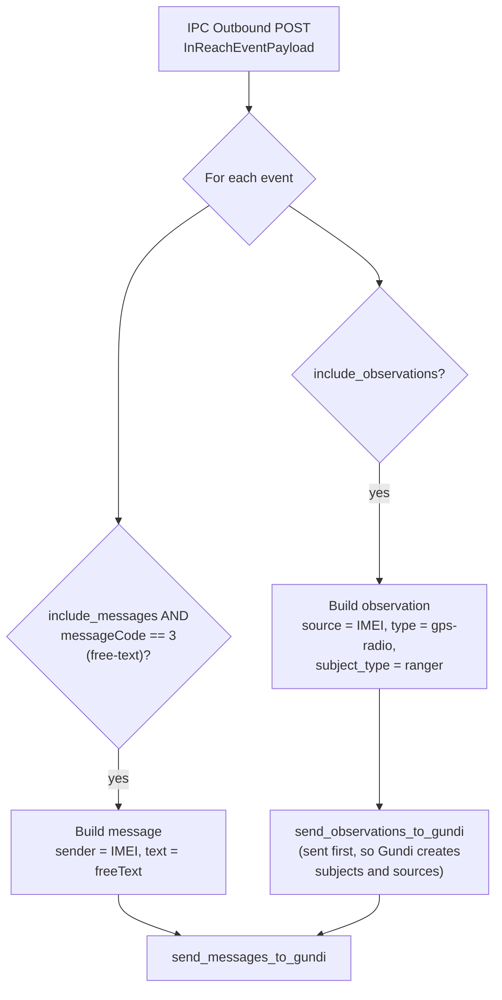
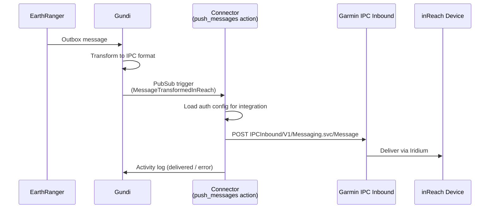

# How It Works

## Device → EarthRanger: IPC Outbound webhook

Garmin's **IPC Outbound** service pushes device events to the connector as HTTP POSTs on `POST /webhooks/`. The payload is validated against a fixed Pydantic schema (`InReachWebhookPayload` in `app/webhooks/inreach.py`):

```json
{
  "Version": "2.0",
  "Events": [
    {
      "imei": "300434030000000",
      "messageCode": 0,
      "freeText": "",
      "timeStamp": "2026-08-31T12:00:00Z",
      "addresses": [{"address": "example@earthranger.com"}],
      "point": {
        "latitude": -1.28,
        "longitude": 36.82,
        "altitude": 1600,
        "gpsFix": 2,
        "course": 90,
        "speed": 5
      },
      "status": {
        "autonomous": 0,
        "lowBattery": 0,
        "intervalChange": 0,
        "resetDetected": 0
      }
    }
  ]
}
```

### Processing pipeline

The webhook handler (`app/webhooks/handlers.py`) walks each event in the payload and produces up to two kinds of Gundi records:



Key behaviors:

- **Every event becomes an observation** (when `include_observations` is on), regardless of message code — position reports, check-ins, SOS events, and even free-text messages all carry a location fix worth recording.
- **Only free-text events (`messageCode = 3`) become messages** (when `include_messages` is on). Other codes are logged and skipped for message extraction.
- **Observations are sent before messages** so that Gundi creates the subject and source for a new device before any message references it.
- The handler returns `{"total_observations": N, "total_messages": M}`, which is recorded in the Gundi activity log via the `@webhook_activity_logger()` decorator.

### Observation format

Each observation sent to Gundi contains:

| Field | Value |
|-------|-------|
| `source` / `source_name` | Device IMEI |
| `type` | `gps-radio` |
| `subject_type` | `ranger` |
| `recorded_at` | Event `timeStamp` |
| `location` | `lat` / `lon` from the event point |
| `additional` | Battery status (including a computed `low_battery_label`: `ok` / `low` / `not indicated`), altitude, GPS fix, course, speed, and the other status flags |

### Message format

Free-text events become Gundi messages with `sender` = IMEI, `text` = the free text, the event location, and `additional` metadata (message code, status flags, and the recipient addresses Garmin reported).

### Supported message codes

The `messageCode` values recognized by the connector (`MessageCodeEnum`):

| Code | Meaning |
|------|---------|
| 0 | Position report |
| 2 | Locate response |
| 3 | Free-text message |
| 4 | Declare SOS |
| 6 | Confirm SOS |
| 7 | Cancel SOS |
| 8 | Reference point |
| 9 | Check-in |
| 10 | Start track |
| 11 | Track interval changed |
| 12 | Stop track |
| 14–16 | Puck messages |
| 17 | MapShare |
| 20 | Mail check |

Other codes exist — see the [Garmin IPC Outbound Developer Guide](https://developer.garmin.com/inReach/IPC_Outbound.pdf).

## EarthRanger → Device: the `push_messages` action

Messages composed in EarthRanger travel through Gundi, which transforms them into IPC message format and triggers the connector's `push_messages` action via GCP PubSub:



The action (`app/actions/handlers.py`):

1. Loads the integration's `auth` configuration (IPC Inbound URL and credentials) from the Gundi portal settings.
2. Sends the transformed message to Garmin's `IPCInbound/V1/Messaging.svc/Message` endpoint using HTTP basic auth (`app/actions/inreach_client/client.py`).
3. On success, writes a `Message Delivered` activity-log entry; on failure, logs the error details and re-raises so GCP retries the delivery.
4. The whole flow is traced with OpenTelemetry, linked to the originating Gundi trace via metadata.

!!! note "Delivery vs. acceptance"
    A successful IPC Inbound API response means **Garmin accepted the command**. Actual delivery to the handset still depends on the device communicating with the Iridium network.

### Error handling

The `InReachClient` maps Garmin's error responses onto typed exceptions:

- **Authentication failures** → `InReachAuthenticationError` (surfaced as invalid credentials in the portal)
- **HTTP 502/503/504 or connection failures** → `InReachServiceUnreachable`
- **HTTP 500** → `InReachInternalError`
- **Garmin error codes** in the response body are mapped to specific exceptions where known

Failed message deliveries are re-raised so that GCP PubSub retries them, and every failure is recorded in the integration's activity log with the error details and traceback.

## The `auth` action

When credentials are entered or tested in the Gundi portal, the `auth` action validates them by calling Garmin's `IPCInbound/V1/Pingback.svc/PingbackRequest` endpoint. It returns `{"valid_credentials": true}` on success, or an error description otherwise. All three fields (URL, username, password) are required for the check.
