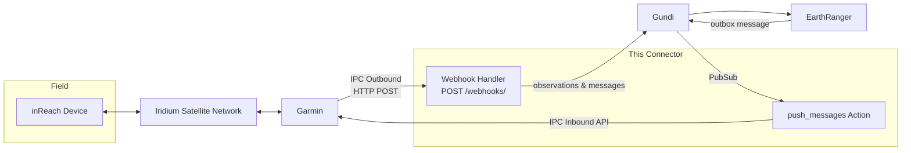

# Overview

This is the **Garmin inReach connector for [Gundi](https://gundiservice.org) v2** — a FastAPI service that bridges Garmin inReach satellite communicators and the Gundi data platform, which in turn feeds conservation platforms such as [EarthRanger](https://www.earthranger.com).

The connector supports **two-way communication**:

- **Device → EarthRanger (outbound):** Garmin pushes device data (tracking points, free-text messages, SOS events) to this connector via **inReach Portal Connect (IPC) Outbound** webhooks. The connector transforms the data and forwards it to Gundi as observations and messages.
- **EarthRanger → Device (inbound):** Messages composed in EarthRanger are routed through Gundi to this connector, which delivers them to inReach devices via the **IPC Inbound** API.

## Data flow

## What gets synchronized

| Direction | Data | Result |
|-----------|------|--------|
| Device → EarthRanger | Tracking points, check-ins, SOS, and other events | Observations (`gps-radio` source, `ranger` subject) with location, speed, course, altitude, and battery status |
| Device → EarthRanger | Free-text messages (`messageCode = 3`) | Two-way messages attached to the device's subject |
| EarthRanger → Device | Text messages | Delivered to the device's IMEI over the Iridium network |

## Requirements

- A **Garmin inReach Professional account** with Portal Connect (IPC) enabled — see [Garmin Accounts & Flex Plans](garmin-accounts.md) for how account types and device service plans relate to the integration
- **IPC Outbound** configured in Garmin Explore to point at this connector's webhook URL (provided by Gundi)
- **IPC Inbound credentials** (for sending messages to devices) configured in the Gundi portal — see [Configuration](configuration.md)

## Repository layout

This connector is built from the [gundi-integration-action-runner](https://github.com/PADAS/gundi-integration-action-runner) template. The integration-specific code lives in:

| Path | Purpose |
|------|---------|
| `app/webhooks/handlers.py` | Processes IPC Outbound events into Gundi observations and messages |
| `app/webhooks/inreach.py` | Pydantic models for the IPC Outbound payload |
| `app/actions/handlers.py` | `auth` (credential check) and `push_messages` (IPC Inbound delivery) actions |
| `app/actions/inreach_client/` | Async HTTP client for the Garmin IPC Inbound API |
| `app/actions/configurations.py` / `app/webhooks/configurations.py` | Configuration models rendered in the Gundi portal |
